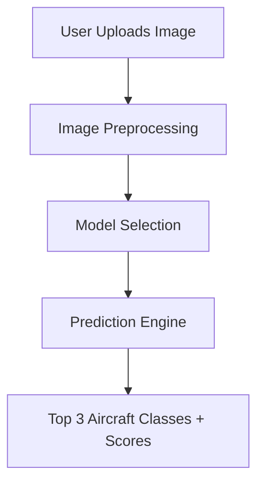

---


<h1 align="center">✈️ Fighter Jet Classification using Deep Learning</h1>
<p align="center">
  <b>A complete AI system that classifies 100 types of fighter jets from real-world images using CNN and MobileNetV2.</b>
</p>

---

## 📚 Table of Contents
- [🚀 Project Overview](#-project-overview)
- [🧠 Why Deep Learning for Fighter Jets?](#-why-deep-learning-for-fighter-jets)
- [🗃️ Dataset](#-dataset)
- [🛠️ Tools & Environment](#-tools--environment)
- [🧱 System Architecture](#-system-architecture)
- [🧪 Models & Comparison](#-models--comparison)
- [📈 Training Progress](#-training-progress)
- [🔍 Prediction Example](#-prediction-example)
- [🧰 How to Run](#-how-to-run)
- [🔮 Future Enhancements](#-future-enhancements)
- [🎓 Lessons Learned](#-lessons-learned)
- [📎 Files Overview](#-files-overview)
- [🤝 Credits](#-credits)
- [🌐 Links](#-links)
- [👨‍💻 Author](#-author)

---

## 🚀 Project Overview
This project presents a robust and intelligent deep learning solution for **fighter jet classification**. Leveraging the **FGVC-Aircraft (2013) dataset**, we:

- Built and compared **three deep learning models**: a custom CNN, MobileNetV2, and a fine-tuned MobileNetV2.
- Developed a **prediction system** that outputs the **Top 3 most likely aircraft types** with confidence scores.
- Applied advanced **data cleaning**, **augmentation**, and **fine-tuning techniques**.

> 📸 Upload a fighter jet image → Get instant identification results.

---

## 🧠 Why Deep Learning for Fighter Jets?
Traditional computer vision struggles with fine-grained aircraft differences. Fighter jets often have similar silhouettes, but deep learning (especially **CNNs**) can:

- Learn **complex visual features**.
- Generalize across angles, lighting, and resolutions.
- Provide **high classification accuracy**.


---

## 🗃️ Dataset
- 📦 **FGVC-Aircraft 2013b** — 10,000+ images / 100 aircraft types
- 📍 Source: [Kaggle Dataset](https://www.kaggle.com/datasets/seryouxblaster764/fgvc-aircraft)
- 🌐 Multiple views, environments, and conditions

> ✨ All images were cleaned, renamed, and augmented with rotation, brightness, zoom, and flipping.

---

## 🛠️ Tools & Environment
| Tool | Purpose |
|------|---------|
| Google Colab (GPU) | Training platform |
| TensorFlow / Keras | Deep learning models |
| NumPy, Pandas | Data manipulation |
| Matplotlib | Charts and visualizations |
| OpenCV | Image preprocessing |

---

## 🧱 System Architecture


---

## 🧪 Models & Comparison
<details>
<summary><b>📊 Click to expand model comparison</b></summary>

| Model | Accuracy | Training Time | Speed | Notes |
|-------|----------|---------------|-------|-------|
| CNN (Scratch) | ~2-3% | Slow | Slow | Basic baseline |
| MobileNetV2 | 20-30% | Medium | Fast | Pre-trained |
| Fine-Tuned MobileNetV2 ⭐ | 35-45% | Moderate | Very Fast | Best performance |

✅ Final Model: **Fine-Tuned MobileNetV2**
</details>

---

## 📈 Training Progress
### CNN Accuracy Over Epochs


---

## 🔍 Prediction Example
<p align="center">
  
</p>

**Prediction Output:**
- 🥇 F-16 → 75% confidence  
- 🥈 F-15 → 15% confidence  
- 🥉 F-22 → 7% confidence  

> Even with close aircraft types, the system outputs a clear Top 3 list.

---

## 🧰 How to Run
```bash
# Clone repo
git clone https://github.com/yourusername/fighter-jet-classification.git
cd fighter-jet-classification

# Install requirements
pip install -r requirements.txt

# Run in Jupyter or Colab
jupyter notebook notebooks/Final_project.ipynb
```

---

## 🔮 Future Enhancements
- 🖼️ Add more high-res & synthetic images
- 🌐 Deploy as a full **web application** (Streamlit, Gradio)
- 🎥 Add support for **video frame analysis**
- 📊 Link predictions to aircraft specs via JSON
- 🛰️ Integrate object detection (YOLO, etc.)

---

## 🎓 Lessons Learned
- Data preparation is critical for high accuracy
- Transfer learning significantly boosts performance
- Fine-tuning pre-trained models leads to optimal results

---

## 📎 Files Overview
```
├── notebooks/Final_project.ipynb
├── models/ (not uploaded, see README)
├── report/Fighter Jet Classification Report.pdf
├── src/ (data preprocessing, training, utils)
├── examples/ (sample jet images and expected outputs)
```

---

## 🤝 Credits
- **Prepared by:** Alaa Emad Al Hout (120233046)  
- **Supervisor:** Dr. Ashraf Younis Al-Maghari  
- **Institution:** Islamic University of Gaza

---

## 🌐 Links
- 📂 [FGVC-Aircraft Dataset](https://www.kaggle.com/datasets/seryouxblaster764/fgvc-aircraft)
- 📘 [PDF Report](./report/Fighter%20Jet%20Classification%20Report.pdf)
- 🚀 Optional: [Live Colab Demo](https://colab.research.google.com/)

---

## 👨‍💻 Author
<p align="center">
  
</p>

**Alaa Emad Al Hout**  
📧 [alaa@example.com](mailto:alaa@example.com)  
🌐 [LinkedIn](https://www.linkedin.com/in/yourprofile) · [GitHub](https://github.com/yourusername)

---

<p align="center">
  
</p>

<h3 align="center">Built with 🚀 Deep Learning & ❤️ for Aviation</h3>
